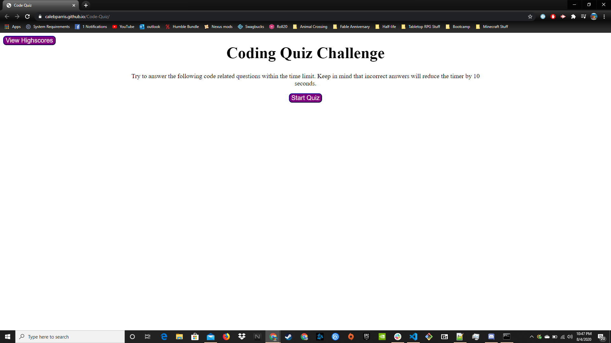

# Code-Quiz

## Objective
This homework was to create a quiz that would dynamically change questions and answers. Another objective was to have a timer that displayed throughout the quiz and lost time for wrong answers. The last objective was to save user score data and save it in the local storage.

## Challenges & Solutions
The first challenge I came across was getting the questions to change dynamically. I had tried to use and array of objects that held all the questions and answers, but I was unable to get the quiz to function this way. I solved this by creating individual arrays for the answer choices and questions. The next challenge I came across was to get the user data stored in local storage and displayed on the page. The solution I had for this was to store the information in an object and create a list element for each name entry so that it would display on the page.

## Links and Pictures
Here is a link to the finished quiz: https://calebparris.github.io/Code-Quiz/

Here is a screenshot of the starting page:

